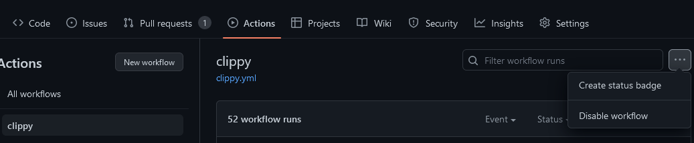

# gha-badge

## Create Badge from GitHub

Open "Actions" tab, select an action, then open `...` and select `Create status badge`.

more info: https://docs.github.com/en/actions/monitoring-and-troubleshooting-workflows/adding-a-workflow-status-badge

